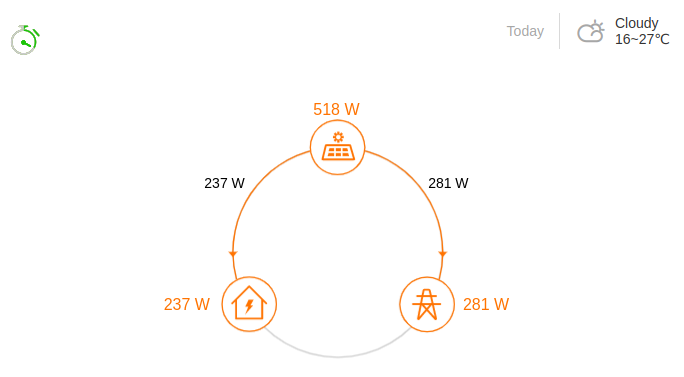
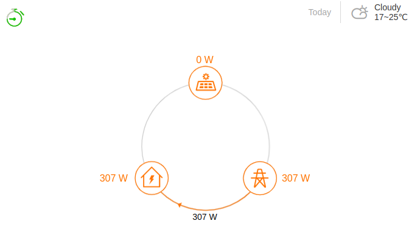
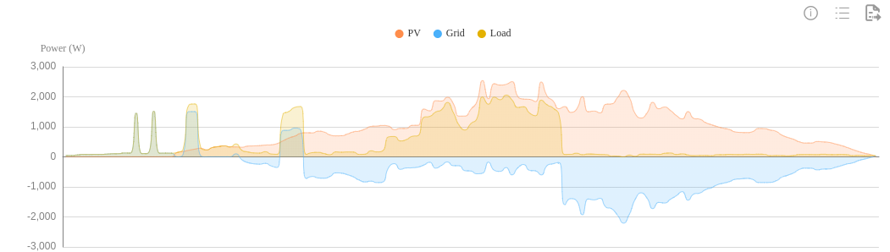

# Sungrow-Meter-cheater
Sungrow S100 power meter emulation using a Raspberry Pi

#### Project objectives
This is a research project that aims to emulate a Sungrow Meter S100

#### Main references
cheater.sh<br>
https://github.com/meltaxa/solariot/issues/27<br>
https://stackoverflow.com/questions/2746553/read-values-into-a-shell-variable-from-a-pipe<br>
https://www.exploringbinary.com/twos-complement-converter/<br>

calc_crc16.sh<br>
https://ctlsys.com/support/how_to_compute_the_modbus_rtu_message_crc/<br>
https://github.com/onslauth/bash_crc16<br>
https://stackoverflow.com/questions/8564267/crc16-algorithm-from-c-to-bash<br>
https://crccalc.com/<br>

#### Requeriments
1. A Sungrow inverter, I'm using a SG5.0RS
2. A Raspberry Pi, I'm using a Raspberry Pi 3B+ and a 2 GB SD card
3. Raspberry Pi OS Lite, I'm using 32-bit: https://www.raspberrypi.com/software/operating-systems/#raspberry-pi-os-32-bit
4. A 485 dongle, I'm using a ARCELI USB to 485 adapter: https://amzn.eu/d/59K0N9B
5. Install the required software: sudo apt install screen stty curl jq

#### Installation
Connect two wires from COM2 terminals (A2,B2) to 485 adapter terminals (D+,D-). Read the documentation of you inverter, I have used the page 20 of this manual:  https://aus.sungrowpower.com/upload/file/20210707/SG2.0-6.0RS-UEN-Ver11-202106.pdf

#### Configuring /home/pi
1. Create a .screenrc file on /home/pi with this content:
```
# don't display the copyright page
startup_message off

# cheater.sh
chdir /home/pi/cheater
screen -t "cheater.sh" ./cheater.sh

# return to shell
detach
```

2. Copy these files to /home/pi/cheater
```
cheater.sh
Shelly_get_em0.sh
calc_crc16.sh
```

#### Configuring crontab for 'pi' user
1. Run "crontab -e" and add:
```
@reboot screen -d -m
```

2. Not mandatory but recommended: run "sudo crontab -e" and add:
```
0 4   *       *       *       /sbin/reboot
```

3. Reboot and run "screen -r" to check if the communication is working:
```
answer=FE0310000000D80000000000000000000000D8E0DA (216 W)
answering to fe03016400081020
answer=FE0310000000D80000000000000000000000D8E0DA (216 W)
answering to fe03016400081020
answer=FE0310000000D80000000000000000000000D8E0DA (216 W)
answering to fe03016400081020
answer=FE0310000000D80000000000000000000000D8E0DA (216 W)
unknown request fffe030164000810
answering to fe03016400081020
answer=FE0310000000DA0000000000000000000000DA6659 (218 W)
answering to fe03016400081020
answer=FE0310000000DB0000000000000000000000DBA518 (219 W)
unknown request fffe030164000810
answering to fe03016400081020
answer=FE0310000000DB0000000000000000000000DBA518 (219 W)
answering to fe03016400081020
...
```

4. Exit from screen command using the sequence (Control+a)+d

#### Images
Injection:<br>


Consumption:<br>


Trend:<br>

